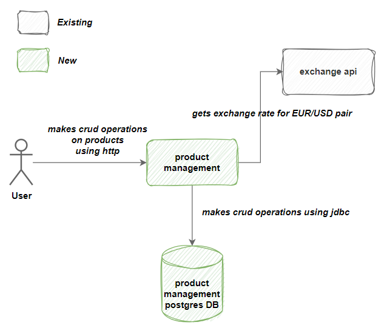

# Product management service
## Description
This service is responsible for managing products. It provides the following functionalities:
- Create a product
- Update a product
- Delete a product
- Get a products list
- Get a product by id

## High level design

- User calls a product management service to create/update/delete/get a product using http
- Product management service uses a postgres db to store/retrieve products
- Product management service uses a https://api.hnb.hr api to get a middle price in USD for a product

## API
can be found here: ```/swagger-ui/index.html```

## How to run
- download sources
- run ```gradle build``` command
- run ```docker-compose up``` command

## How to test
### Unit & Integration tests
To run unit and integration tests use the following command:
```gradle test```

### Smoke tests
Run application and open ```/swagger-ui/index.html```

## Assumptions
 - Middle price was taken from a https://api.hnb.hr api since it is not described in the requirements. 
But it can be easily changed if needed.
 - Usually it's not a best practice to make "delete" endpoints which remove the data from db and probably makes
sense to change "active" state in products table. But since it's not described in the requirements Was decided to
 leave it as is (for testing purposes for example.)

## Rooms for improvement
 - https://api.hnb.hr api can be unavailable. We use feign client with circuit breaker pattern to handle this situation.
Right now it only logs a warning and returns empty result. But there is any reliability pattern can be 
implemented (retries, alternative api etc.).

 - There is an assumption, that docker will be installed on a machine where this service will be deployed.
But if it's not so - we can add separate application yml file for a "local" profile and specify a connection to
a in memory h2 db. Decided to don't spend a time on this and just describe it as an opetion.

 - The PUT method was implemented to replace a whole product object. To make it more flexible we can add PATCH method

 - Security was not added since it's not described in the requirements. But it can be easily added with spring security
